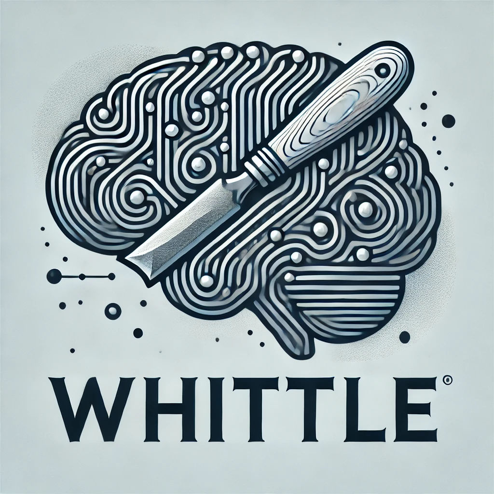
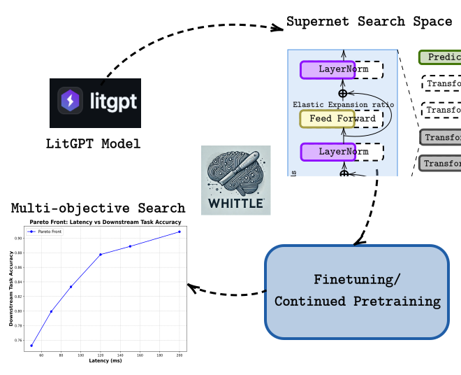

<p align="center">
  
</p>

<h1 align="center">Whittle 🪒🧠</h1>

<p align="center">
  
</p>


[](https://github.com/whittle-org/whittle/blob/main/LICENSE)
[](https://pypi.org/project/whittle/)

Whittle is a Python library for compressing large language models (LLMs) 
by extracting sub-networks to balance performance and efficiency. It is based on [LitGPT](https://github.com/Lightning-AI/litgpt)
and allows to compress many state-of-the-art models.


- **Neural Architecture Search:** Workflows for [pre-training super-networks](whittle/pretrain_super_network.py) and [multi-objective search](whittle/search_sub_networks.py) to select sub-networks.
- **Structural Pruning:** State-of-the-art approaches to [pruning](whittle/prune.py) structural components of pre-trained LLMs.
- **Distillation:** Workflow to [distill](whittle/distill.py) a student model given a trained teacher model.
- **Evaluation**: Easy extraction of sub-networks checkpoint and evaluation using LM-Eval-Harness
- **Efficiency**: Different metrics to estimate efficiency of sub-networks, such as latency, FLOPs, or energy consumption.

## Installation

Whittle supports and is tested for python 3.9 to 3.12. 

You can install whittle with: 
```
pip install whittle
```


### Install from source  

Install whittle from source to get the most recent version:
```
git clone git@github.com:whittle-org/whittle.git
cd whittle
pip install -e .
```
### Getting started with whittle  

To explore and understand different functionalities of ```whittle``` checkout [this](https://colab.research.google.com/drive/1i_FjIf_qCTJFcp0emOHX9E6I6j6kkIcH?usp=sharing) colab notebook and ```examples/```

## Projects that use whittle

- [Structural Pruning of Pre-trained Language Models via Neural Architecture Search](https://github.com/whittle-org/plm_pruning)
- [HW-GPT Bench](https://github.com/automl/HW-GPT-Bench)

## How to get involved

We more than happy for any code contribution. If you are interested in contribution to whittle, 
please read our [contribution guide](CONTRIBUTING.md).